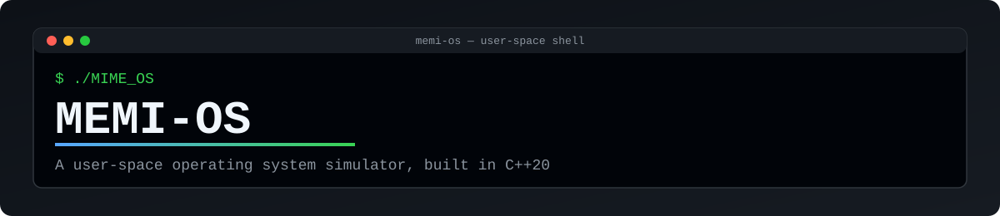
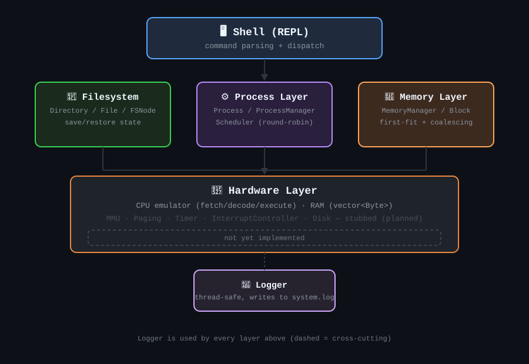
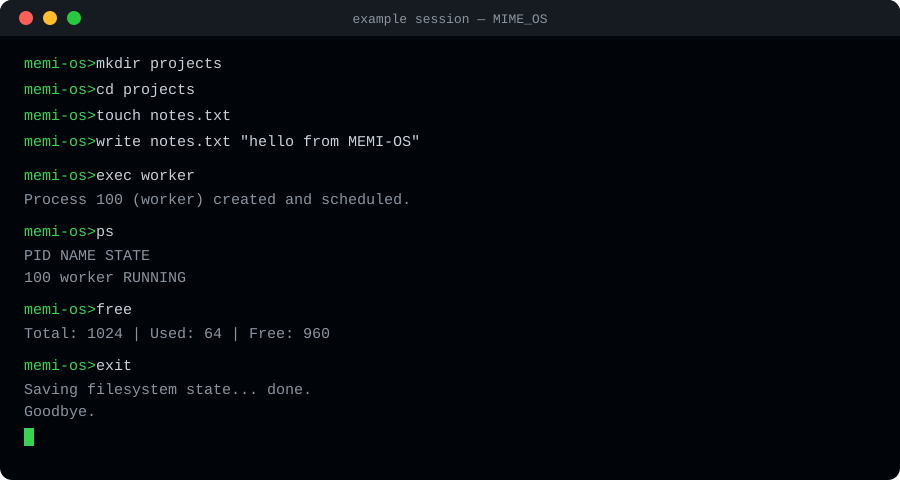

<p align="center">
  
</p>

<h1 align="center">MEMI-OS 🖥️</h1>

<p align="center">
A user-space operating system <strong>simulator</strong> written in C++20. MEMI-OS models the core building blocks of an operating system — a command shell, an in-memory filesystem, process management, scheduling, and memory allocation — as a learning/research project, rather than a bootable kernel.
</p>

> 🚧 **Status:** Active work-in-progress. Core subsystems are functional; several hardware-level modules are stubbed out (see [Known Limitations](#-known-limitations--roadmap) below).

---

## 📖 Overview

MEMI-OS runs as a regular desktop program that opens its own terminal window and drops you into an interactive shell. From there you can create files and directories, run and kill simulated processes, inspect memory usage, and execute simple scripts — all backed by custom-built subsystems rather than OS/libc calls.

It's designed to make OS concepts tangible: watching a scheduler round-robin between processes 🔄, or seeing a memory manager split and coalesce blocks 🧩, without needing a real kernel or bootloader.

## ✨ Features

- 💻 **Interactive shell (REPL)** — tokenized command input with 15+ built-in commands
- 📁 **In-memory hierarchical filesystem** — directories and files with create, read, write, append, and clear operations, plus save-to-disk state export
- ⚙️ **Process management** — process creation/termination with PID tracking and lifecycle states (READY, RUNNING, TERMINATED, etc.)
- 🔄 **Scheduler** — time-quantum–based round-robin scheduling (default quantum: 3 ticks)
- 🧮 **Memory manager** — contiguous first-fit block allocator with free-block coalescing
- 🔧 **Simulated hardware layer** — a small RAM model (`std::vector<Byte>`) and a minimal CPU emulator (fetch/decode/execute with a handful of opcodes)
- 📝 **Logging subsystem** — thread-safe, timestamped logging to `data/logs/system.log`
- 📜 **Script execution** — run a sequence of shell commands from a file via `run`

## 🏗️ Architecture

MEMI-OS is organized into five layers:

<p align="center">
  
</p>

On launch, `main.cpp` spawns a terminal window (via `gnome-terminal`, falling back to `xterm`), initializes the logger, constructs the `Shell`, and enters the REPL loop. The scheduler advances on every shell loop iteration — there is currently no hardware-timer-driven preemption.

## 🚀 Getting Started

### Prerequisites

- ✅ A C++20-capable compiler (e.g. GCC 10+ or Clang 12+)
- ✅ [CMake](https://cmake.org/) 3.x+
- ✅ Linux with `gnome-terminal` or `xterm` available (used to spawn the shell's terminal window)

### Build

```bash
git clone <this-repo-url>
cd MEMI-OS
mkdir build && cd build
cmake ..
make
```

This produces an executable (`MIME_OS`) that collects and compiles all `.cpp` files under `src/`, with `include/` on the include path.

### Run

```bash
./MIME_OS
```

The program will relaunch itself inside a new terminal window unless invoked with `--new-window`.

## 💻 Usage

Once inside the shell, the following commands are available:

| Command | Description |
|---|---|
| `help` | List available commands |
| `clear` | Clear the terminal |
| `ls` | List contents of the current directory |
| `pwd` | Print the current working directory |
| `mkdir <name>` | Create a directory |
| `touch <name>` | Create a file |
| `cd <name>` | Change directory |
| `cat <file>` | Print a file's contents |
| `write <file> <text>` | Append text to a file |
| `rewrite <file> <text>` | Overwrite a file's contents |
| `clean <file>` | Clear a file's contents |
| `run <script>` | Execute a sequence of commands from a script file |
| `ps` | List running/simulated processes |
| `exec <name>` | Create and schedule a new process |
| `kill <pid>` | Terminate a process by PID |
| `free` / `mem` | Show memory allocation status |
| `exit` / `quit` | Save filesystem state and exit |

Here's an illustrative mockup of what a session looks like end-to-end:

<p align="center">
  
</p>

## 📁 Project Structure

```
MEMI-OS/
├── src/
│   ├── main.cpp
│   ├── kernel/
│   │   ├── shell/       # Shell.cpp, Commands.cpp, Paser.cpp
│   │   ├── logging/     # Logger.cpp
│   │   ├── process/     # Process.cpp, ProcessManager.cpp, Scheduler.cpp
│   │   └── memory/      # MemoryManager.cpp, Block.cpp, Paging.cpp
│   ├── hardware/        # CPU.cpp, RAM.cpp, MMU.cpp, Timer.cpp, Disk.cpp, InterruptController.cpp
│   ├── filesystem/      # File.cpp, Directory.cpp, FileSystem.cpp, Permission.cpp
│   └── utils/           # StringUtils.cpp, TimeUtils.cpp, Helper.cpp
├── include/             # Mirrors src/ layout with corresponding headers
├── assets/              # README images (banner, diagrams)
├── data/
│   ├── logs/system.log         # Runtime log output
│   └── fs_image/systemFile.img # Saved filesystem state
├── CMakeLists.txt
└── .vscode/             # Editor tasks and debug configuration
```

## 🚧 Known Limitations & Roadmap

MEMI-OS is a simulator, not a real kernel — there's no bootloader, GDT/IDT setup, real interrupt handling, or hardware drivers. Within the simulated scope, a few pieces are still incomplete:

- ⚠️ **`FileSystem::loadState()`** is declared but not implemented, so filesystem state currently saves on exit but does not restore on the next run
- ⚠️ **`Commands::cmdExit()`** is declared but has no implementation
- 🧱 **Paging, MMU, Timer, InterruptController, and Disk** modules exist as empty stub files, reserved for future work
- 🔒 **Permission system** (`Permission.cpp`) is not yet implemented
- ⏱️ Scheduling is currently driven by the shell loop rather than a real timer/interrupt

Planned next steps:
1. 🛠️ Fix memory manager initialization and edge-case handling
2. 💾 Implement `FileSystem::loadState()` for full save/restore persistence
3. ✏️ Build out a proper command parser (currently uses basic string splitting)
4. ⏰ Introduce a timer-driven scheduler and basic interrupt handling
5. 🧠 Expand the CPU emulator's instruction set and add real context switching
6. 🧹 Migrate from raw pointers to smart pointers throughout

## 🤝 Contributing

This is currently a personal/learning project. Issues and pull requests are welcome if you'd like to help implement any of the roadmap items above. 🙌

## 📄 License

See [LICENSE](./LICENSE) for details.
